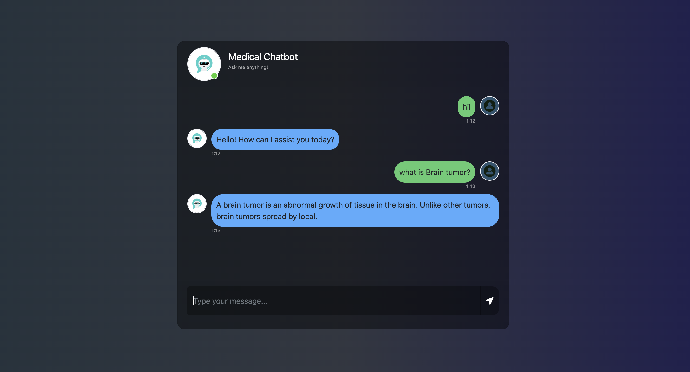

# 🩺 End-to-End Medical Chatbot (RAG-based)

> An intelligent **Medical Chatbot** built using **RAG (Retrieval-Augmented Generation)**, powered by **OpenAI API, Pinecone, LangChain, and Flask**.  
It allows users to ask **health-related queries** and receive contextual answers retrieved from a **vector database of medical knowledge**.

---

## 🚀 Features
- ✅ Retrieval-Augmented Generation (RAG) pipeline  
- ✅ Stores medical documents in **Pinecone Vector DB**  
- ✅ Uses **OpenAI GPT model** for accurate and conversational responses  
- ✅ User-friendly **Flask Web Interface**  
- ✅ End-to-End working solution  

---

## 🛠️ Tech Stack
- **Python**
- **Flask**
- **LangChain**
- **OpenAI API**
- **Pinecone (Vector DB)**
- **HTML, CSS, JS (Frontend)**

---

## ⚡ How to Run Locally

### 1️⃣ Clone the Repository
```bash
git clone https://github.com/Akshat48002/Medical-ChatBot.git
```
```bash
cd Medical-ChatBot
```

### STEP 01- Create a conda environment after opening the repository
```bash
conda create -n mchatbot python=3.11.9 -y
```
```bash
conda activate mchatbot
```

### STEP 02- install the requirements
```bash
pip install -r requirements.txt
```
### Create a `.env` file in the root directory and add your Pinecone credentials as follows:

```ini
PINECONE_API_KEY = "xxxxxxxxxxxxxxxxxxxxxxxxxxxxx"
OPENAI_API_KEY = "xxxxxxxxxxxxxxxxxxxxxxxxxxxxx"
```

# Store Medical Knowledge in Vector DB
```bash
# run the following command
python store_index.py
```

# Run the App
```bash
# Finally run the following command
python app.py
```
Now,
```bash
open up localhost:
```

## 📸 Demo Screenshots

### Chat UI


### Techstack Used:

- Python
- LangChain
- Flask
- OpenAI
- Pinecone
